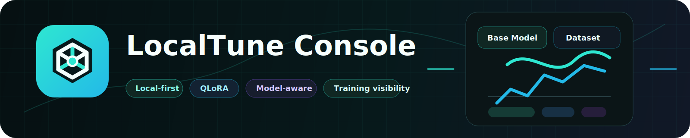
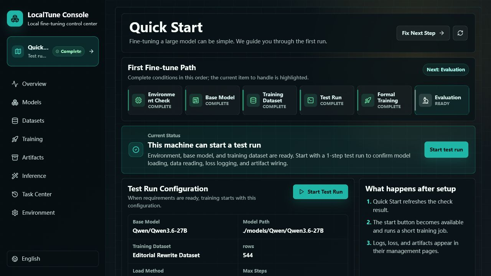
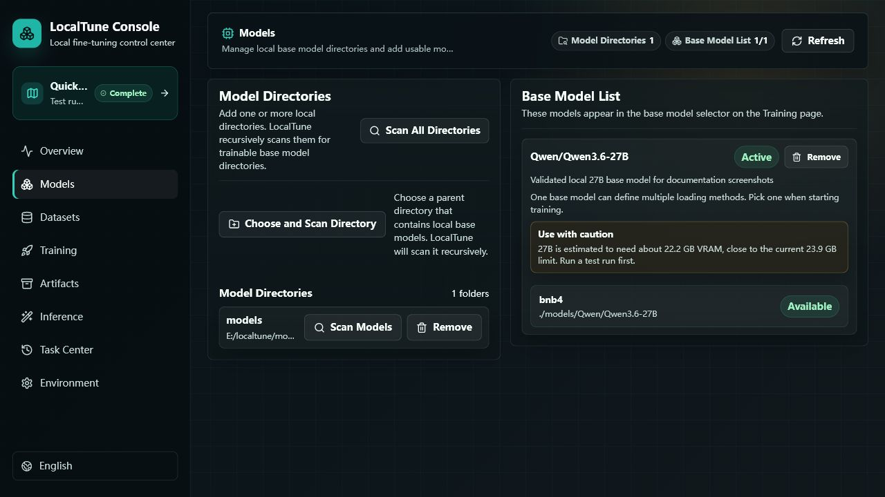
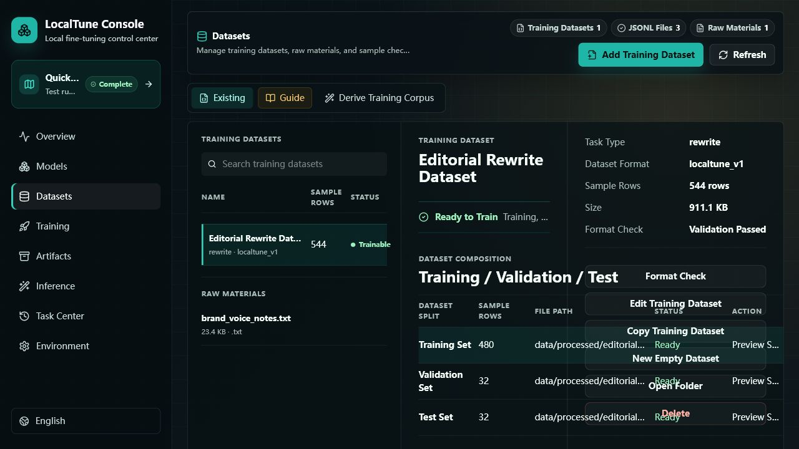
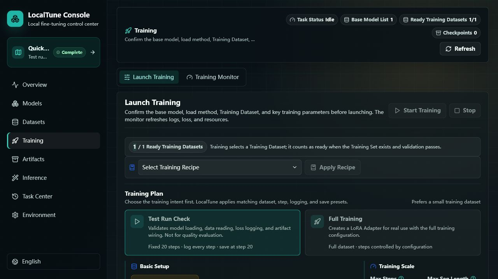

# LocalTune Console

[English](README.md) | [简体中文](README.zh-CN.md)

<p align="center">
  
</p>

<p align="center">
  <strong>Turn a local LLM into a model that speaks your language, follows your format, and works inside your workflow.</strong>
</p>

<p align="center">
  <a href="#quick-start"></a>
  
  
  
  
</p>

LocalTune Console is a browser-based control center for **local LLM fine-tuning**. Bring a trainable base model, bring your JSONL dataset, and use one local console to prepare data, launch short test runs and formal QLoRA runs, watch logs and loss curves, manage Adapters, and compare Base vs Adapter outputs.

## Screenshots

| Quick Start | Model Management |
| --- | --- |
|  |  |
| Dataset Management | Training Execution |
|  |  |

## Why Fine-Tune?

Prompting asks a model to behave differently for one request. Fine-tuning teaches it to behave differently by default.

Use LocalTune Console when you want to:

| Scenario | What fine-tuning can unlock |
| --- | --- |
| Writing style | Rewrite drafts in a specific author, brand, or editorial voice. |
| Team operations | Make support, sales, review, or moderation replies follow your internal tone and rules. |
| Domain work | Turn field notes, procedures, or cases into consistent answers, summaries, or structured outputs. |
| Format reliability | Reduce prompt-by-prompt drift when the output must follow a repeatable schema. |

## What Makes It Useful

| Built for local fine-tuning | What you get |
| --- | --- |
| First-run guidance | A Quick Start page walks from environment checks to the first short test run. |
| Model-aware setup | Scanned models are checked against the current GPU memory and shown as recommended, cautious, or not recommended. |
| Dataset control | Dataset Profiles, train/val/test splits, structured preview, validation, search, and split extraction. |
| Training visibility | Live task status, logs, loss curves, resource telemetry, history, and exact artifact relationships. |
| Local by default | Models, datasets, logs, checkpoints, and Adapters stay on your machine. |

LocalTune Console is intentionally scoped as a **fine-tuning workbench**. It is not a RAG system, knowledge base, chat client, or model API server.

## Support Snapshot

| Status | Environment | Notes |
| --- | --- | --- |
| Verified now | Windows + NVIDIA CUDA GPU | Validated with Qwen 3.6 27B, PEFT, bitsandbytes NF4 QLoRA, and about 24 GB VRAM. |
| Planned | Linux + NVIDIA CUDA; macOS + Apple Silicon | Linux CUDA is closest to the current stack. Apple Silicon needs a separate MLX LoRA path. |
| Not planned for fine-tuning | Intel XPU, AMD ROCm, CPU-only | Console and dataset features may work, but the current fine-tuning path is unavailable. |

## Quick Start

On Windows, download the project and run:

```powershell
.\start_localtune.bat
```

The first start creates the Python environment, prepares local config, installs the project-local frontend toolchain when needed, builds the web console, waits until the dashboard is ready, and opens it in your browser.

You still need to provide:

- a local Transformers-compatible base model directory;
- JSONL training data;
- a supported NVIDIA CUDA environment if you want to produce a fine-tuned Adapter today.

If you get stuck, start with the [FAQ](docs/FAQ.md), [Troubleshooting Guide](docs/TROUBLESHOOTING.md), and [Glossary](docs/GLOSSARY.md).

## Table of Contents

- [Why Fine-Tune?](#why-fine-tune)
- [What Makes It Useful](#what-makes-it-useful)
- [Support Snapshot](#support-snapshot)
- [Current Capabilities](#current-capabilities)
- [Support Matrix and Hardware Requirements](#support-matrix-and-hardware-requirements)
- [First Training Run](#first-training-run)
- [Dataset Format](#dataset-format)
- [Configuration](#configuration)
- [Testing](#testing)

## Current Capabilities

| Capability | What it does | Status |
| --- | --- | --- |
| Model Management | Add or remove local directories, recursively discover models, explicitly select a base model for training | Available |
| Dataset Management | Manage Dataset Profiles, train/val/test splits, validation, structured preview, search, and split extraction | Available |
| Training Execution | Short test runs and formal runs, parameter guidance, checkpoint resume, and OOM diagnosis | Verified |
| Training Monitoring | Progress, ETA, logs, loss, CPU, memory, and GPU telemetry | Available |
| Task Center | Independent training history with parameters, logs, and exact artifact relationships | Available |
| Artifacts | Manage Adapters, checkpoints, and metrics; archive, restore, mark best, or delete | Available |
| Evaluation | Single inference, Base/Adapter comparison, batch evaluation, and reports | Available |
| Recipes | Export and import reusable training selections and parameters | Available |

BNB4/NF4 QLoRA is the currently supported and validated training path. NVFP4 is not exposed as a fine-tuning entry point in this release.

## Support Matrix and Hardware Requirements

The core value of LocalTune Console is local fine-tuning. The support scope below only describes whether the current QLoRA training path can start and complete; being able to open the console does not count as training support.

| Operating system | Hardware/backend | Training status | Notes |
| --- | --- | --- | --- |
| Windows | NVIDIA GPU + CUDA | Verified for training | Verified on Windows + RTX 5090 Laptop GPU + CUDA 13.0 with a 27B test run. |
| Linux | NVIDIA GPU + CUDA | Target support, needs more validation | Designed to support NVIDIA Linux environments with CUDA 12+ and enough VRAM, but not independently validated in this project yet. |
| macOS | Apple Silicon / MPS | Planned support, needs validation | Planned through a separate MLX LoRA backend for Apple Silicon, not by reusing the current bitsandbytes QLoRA path. |
| Windows / Linux | Intel XPU | No fine-tuning support planned | No training backend or validation path is available. |
| Linux | AMD GPU / ROCm | No fine-tuning support planned | No ROCm training implementation or validation path is available. |
| Any OS | CPU only | No fine-tuning support planned | Console and dataset management can be used; the current local fine-tuning path is unavailable. |

The current production training path is **NVIDIA CUDA + PEFT + bitsandbytes NF4 QLoRA**. If a machine is outside the trainable scope above, users should not expect to produce a fine-tuned result yet.

## Requirements

- For training: Windows or Linux. For console and dataset management: Windows, Linux, or macOS.
- Python 3.12+
- [uv](https://docs.astral.sh/uv/getting-started/installation/)
- Node.js 22+ with npm 10+, or internet access on first start so LocalTune can
  install its project-local Node.js toolchain
- A supported accelerator for training. The validated BNB4 QLoRA path currently
  requires an NVIDIA GPU with CUDA; non-CUDA platforms can still use model
  discovery, dataset management, and compatibility checks.
- Enough disk space for local models and training outputs

The validated 27B test-run setup uses about 24 GB of VRAM. Other models and training parameters have different requirements.

## Detailed Setup

### Fastest Path to a First Result in the Console

1. Install `uv`.
2. Run `.\start_localtune.bat`; the first start creates `.venv`, local config, and built frontend assets.
3. Open **Quick Start** in the left sidebar.
4. Add and scan your local base model directory in **System Environment**.
5. Select the example dataset or import your own JSONL training corpus in **Dataset Management**, then confirm format validation passes.
6. Return to **Quick Start**, confirm the training readiness card says the machine can train, then start a short test run.
7. After the test run completes, use **Evaluation** to compare Base vs Adapter with the generated Adapter.

Install `uv` if it is not already available:

```powershell
# Windows PowerShell
irm https://astral.sh/uv/install.ps1 | iex
```

```bash
# Linux
curl -LsSf https://astral.sh/uv/install.sh | sh
```

Install the Python environment:

```powershell
uv sync
```

The first sync installs the cross-platform base environment from the official
PyPI index. Configure a mirror in your own uv settings if needed.

Optional integrations:

```powershell
uv sync --extra modelscope
uv sync --extra unsloth
```

Start on Windows:

```powershell
.\start_localtune.bat
```

Start on Linux:

```bash
sh start_localtune.sh
```

Start through Python on Windows:

```powershell
.\.venv\Scripts\python.exe scripts\start_dashboard.py
```

Start through Python on Linux:

```bash
.venv/bin/python scripts/start_dashboard.py
```

On first start, LocalTune creates the local configuration from
`configs/model_config.example.yaml`. The generated `configs/model_config.yaml`
is local-only and ignored by Git. LocalTune also detects the available compute
backend and writes a local dependency profile under `configs/runtime/`. On
NVIDIA CUDA machines it installs the CUDA PyTorch wheel and `bitsandbytes` into
the project environment when needed; this can download several gigabytes on the
first CUDA setup. On MPS, XPU, or CPU-only machines it records the backend and
keeps CUDA-only training branches unavailable until a compatible backend is
present. Use `--skip-training-deps` or
`LOCALTUNE_SKIP_TRAINING_DEPS=1` to skip the automatic training dependency
profile step.

If Node.js/npm are unavailable or too old, the startup flow installs Node.js 22
into the project `.venv`. It then installs and builds missing frontend
dependencies before opening the console.

The default address is:

```text
http://127.0.0.1:6543
```

Service settings use this priority: command-line arguments, environment
variables, `configs/model_config.yaml`, then built-in defaults. Supported
environment variables are `LOCALTUNE_HOST` and `LOCALTUNE_PORT`. Vite
development can use `VITE_API_TARGET`.

The dashboard listens on the local machine only by default. It has no user
authentication. Do not expose it to a LAN or the public internet unless you
provide your own access controls.

## First Training Run

The shortest path from a fresh checkout to a short test-run result is:

1. Open **System Environment** and choose a local model directory. LocalTune
   adds the directory and scans its subdirectories immediately.
2. In the scan results, add the detected model to **Model List**.
3. Open **Dataset Management** and choose **Import Training Corpus**. Select a
   JSONL file; LocalTune copies it into `data/processed/`, creates a Dataset
   Profile, and runs a format check.
4. If validation or test splits are missing, use the split action in Dataset
   Management to extract them from the training file.
5. Open **Training**, select the base model, load method, Dataset Profile, and
   test-run parameters. Start with a short run before formal training.
6. Monitor status, loss, resources, and logs on the same page.
7. After completion, use **Validate Final Adapter** from the training trace, or
   review completed runs in **Task Center** and outputs in **Artifacts**.

LocalTune does not silently choose a model or Dataset Profile for a new run.

## Example Local Layout

The paths below are examples, not required locations:

```text
models/
  Qwen/
    Qwen3___6-27B/

data/
  processed/
    train.jsonl
    val.jsonl
    test.jsonl
```

You can add other model directories and create multiple Dataset Profiles from the web console.

Dataset templates for instruction, chat, QA, rewrite, summary, classification,
extraction, tool calling, code, and DPO scenarios are available under
`configs/dataset_templates/`.

## Dataset Format

A Dataset Profile represents one training purpose and references a required
training file plus optional validation and test files. Missing validation or
test splits can be extracted from an existing structured training file in the
web console.

For supervised fine-tuning, each JSONL row may use a supported task-specific
structure. A simple instruction example is:

```json
{
  "instruction": "Summarize the following passage.",
  "input": "Local fine-tuning keeps the workflow under the user's control.",
  "output": "Local fine-tuning gives users direct control over training."
}
```

The format checker identifies invalid JSONL, missing required fields, duplicate
records, and other structural problems. Raw text and source documents are
managed as source material; they are not automatically converted into training
samples.

## Configuration

Local configuration:

```text
configs/model_config.yaml
```

Portable example:

```text
configs/model_config.example.yaml
```

The web console creates per-run configurations under `configs/runtime/` and
writes training outputs to `outputs/localtune/` by default. Model weights,
datasets, runtime configurations, logs, checkpoints, and training outputs are
local working files and are not included in the downloaded project.

## Local Data and Privacy

Normal training reads models and datasets from local storage and writes logs,
metrics, and outputs locally. LocalTune disables W&B reporting for
dashboard-launched training and uses a local `metrics.jsonl` metrics file.

Commands that explicitly download a model or install dependencies connect to the selected external service. LocalTune does not automatically upload your training datasets or model outputs. You remain responsible for the authorization, copyright, privacy, and security requirements of the data and models you use.

The example Qwen configuration enables Transformers `trust_remote_code`. You can
disable it in `configs/model_config.yaml`; only enable it for model directories
from sources you trust because they may contain executable Python code.

## Command Line

The examples below use Windows PowerShell. On Linux, replace
`.\.venv\Scripts\python.exe` with `.venv/bin/python`.

Validate configured datasets:

```powershell
.\.venv\Scripts\python.exe scripts\validate_data.py
```

Run BNB4 training directly:

```powershell
.\.venv\Scripts\python.exe scripts\train.py --branch bnb4 --no-fallback
```

Use another dashboard port:

```powershell
.\start_localtune.bat --port 6544
```

## Testing

Run the local quality gate before release or after UI/API changes:

```powershell
uv run python scripts\quality_check.py
```

The quality gate runs Python tests, frontend unit tests, a production frontend
build, and release-readiness checks. The current automated suite covers:

- model directory scanning and model registration edge cases
- stable API error codes and frontend error-message mapping
- dataset, artifact, recipe, and run-record services
- startup preparation and local toolchain checks
- dark-theme CSS guardrails for high-risk empty, hover, and status states

Use focused commands while developing:

```powershell
uv run pytest -q
.\.venv\Scripts\npm.cmd --prefix frontend run test
.\.venv\Scripts\npm.cmd --prefix frontend run build
```

## Monitoring and Evaluation

Training launched from the web console produces an independent task record,
runtime configuration, log file, checkpoints, Adapter output, and local training
metrics. The Training page shows current progress, loss, resource
usage, and logs. Historical runs remain available in Task Center.

Evaluation supports single prompts, Base/Adapter comparison, and batch runs from
a Dataset Profile. Batch results can be saved as JSON and Markdown reports.
Style or literary quality still requires human review.

For development and pull requests, see [Contributing](CONTRIBUTING.md). Security
issues should follow the private reporting guidance in [Security](SECURITY.md).

## License

MIT. See [LICENSE](LICENSE).
