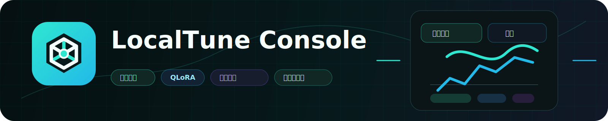
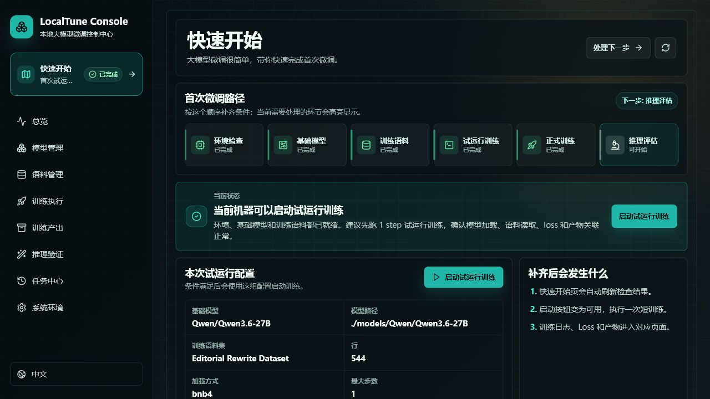
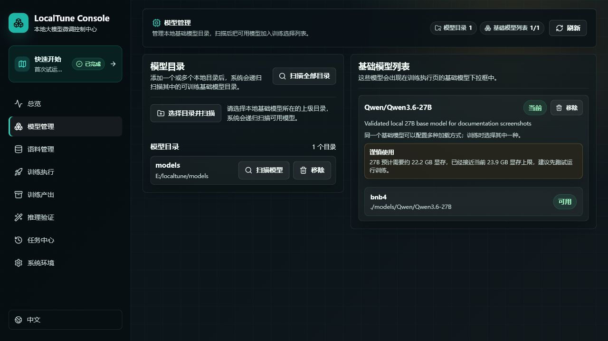
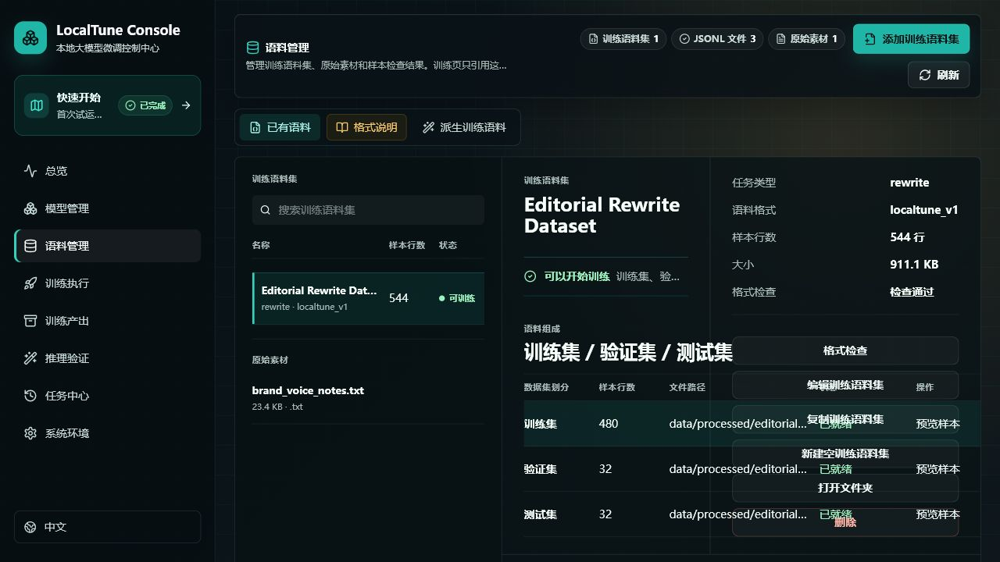
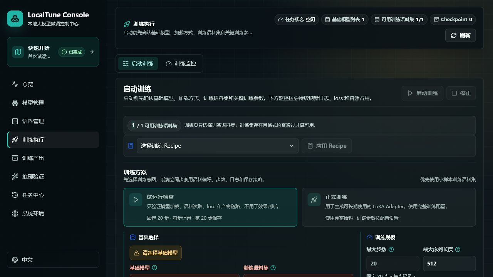

# LocalTune Console

[English](README.md) | [简体中文](README.zh-CN.md)

<p align="center">
  
</p>

<p align="center">
  <strong>把本地大模型调成真正懂你风格、懂你格式、懂你工作流的专属模型。</strong>
</p>

<p align="center">
  <a href="#快速开始"></a>
  
  
  
  
</p>

LocalTune Console 是一个面向**本地大模型微调**的浏览器控制台。你准备好本地基础模型和 JSONL 语料后，它就能帮你管理语料、运行试训练和正式训练、查看日志和 loss 曲线、追踪历史任务、管理 Adapter 产物并进行推理验证——所有这些都在一个统一的工作台中完成。

## 界面预览

| 快速开始 | 模型管理 |
| --- | --- |
|  |  |
| 语料管理 | 训练执行 |
|  |  |

## 为什么要微调？

提示词是在单次请求中"引导"模型改变行为；微调则是让模型从数据中学习，形成更稳定的行为模式。

当你希望模型长期、稳定地按照你的要求输出时，微调会更有价值：

| 场景 | 微调能带来的价值 |
| --- | --- |
| 写作风格 | 把普通文章改写成某位作家、品牌或编辑部的固定口吻。 |
| 团队作业 | 让客服、销售、审核、运营的回复符合团队自己的表达规范和业务规则。 |
| 行业任务 | 把行业笔记、案例、流程、规程转化为稳定的问答、摘要或结构化输出。 |
| 格式稳定 | 当输出必须符合固定 schema 时，减少每次都靠提示词调参带来的不稳定感。 |

## 为什么用它？

| 为本地微调而生 | 你能获得什么 |
| --- | --- |
| 首次训练引导 | 快速开始页面从环境检查、模型选择、语料准备一路引导你完成第一次试训练。 |
| 理解模型规模 | 扫描模型后，根据当前显存给出"适合 / 谨慎 / 不建议"的明确建议。 |
| 语料可控 | 语料档案、train/val/test 划分、格式检查、结构化预览、搜索和数据集切分。 |
| 训练可观察 | 实时查看任务状态、日志、loss 曲线、资源占用，并将历史任务与产物关联起来。 |
| 本地优先 | 模型、语料、日志、Checkpoint 和 Adapter 都保留在你的机器上。 |

LocalTune Console 专注于做**本地微调工作台**，不是 RAG、知识库、聊天客户端或模型 API 服务。

## 支持环境速览

| 状态 | 环境 | 说明 |
| --- | --- | --- |
| 当前已验证 | Windows + NVIDIA CUDA 显卡 | 已使用 Qwen 3.6 27B、PEFT、bitsandbytes NF4 QLoRA 和约 24 GB 显存跑通流程。 |
| 计划支持 | Linux + NVIDIA CUDA；macOS + Apple Silicon | Linux CUDA 与当前技术栈最为接近；Apple Silicon 需要独立的 MLX LoRA 路线。 |
| 暂无微调计划 | Intel XPU、AMD ROCm、仅 CPU | 可以使用部分管理功能，但当前微调训练入口不可用。 |

## 快速开始

Windows 用户下载项目后，最快的启动方式是：

```powershell
.\start_localtune.bat
```

首次启动会自动创建 Python 环境、生成本机配置、在需要时安装项目内前端工具链、构建控制台、等待服务就绪并打开浏览器。

你仍需要自行准备：

- 一个本地 Transformers 兼容的基础模型目录；
- JSONL 格式的训练语料；
- 如果要在当前版本真正训练出 Adapter，需要 NVIDIA CUDA 训练环境。

遇到问题时，请先查看 [FAQ](docs/FAQ.zh-CN.md)、[故障排查](docs/TROUBLESHOOTING.zh-CN.md) 和 [术语表](docs/GLOSSARY.zh-CN.md)。

## 目录

- [为什么要微调？](#为什么要微调)
- [为什么用它？](#为什么用它)
- [支持环境速览](#支持环境速览)
- [当前能力](#当前能力)
- [支持矩阵与硬件要求](#支持矩阵与硬件要求)
- [第一次训练](#第一次训练)
- [语料格式](#语料格式)
- [配置](#配置)
- [测试](#测试)

## 当前能力

| 功能 | 能做什么 | 状态 |
| --- | --- | --- |
| 模型管理 | 添加或删除本地目录、递归发现模型、训练时显式选择基础模型 | 可用 |
| 语料管理 | 管理语料档案、train/val/test、格式检查、结构化预览、搜索和数据集切分 | 可用 |
| 训练执行 | 试训练和正式训练、参数说明、Checkpoint 恢复和 OOM 诊断 | 已验证 |
| 训练监控 | 进度、预计完成时间、日志、loss、CPU、内存和 GPU 状态 | 可用 |
| 任务中心 | 独立的训练历史记录，以及参数、日志和产物的准确关联 | 可用 |
| 训练产出 | 管理 Adapter、Checkpoint 和指标，支持归档、恢复、标记最佳和删除 | 可用 |
| 推理验证 | 单条推理、Base/Adapter 对比、批量评估和报告 | 可用 |
| Recipe | 导出和导入可复用的训练选择与参数 | 可用 |

BNB4/NF4 QLoRA 是当前正式支持并已验证的训练路线。NVFP4 不作为当前版本的微调入口。

## 支持矩阵与硬件要求

LocalTune Console 的核心价值是本地微调训练。下面的支持范围只讨论"能否启动并完成当前 QLoRA 训练流程"，不把"控制台能打开"视为训练支持。

| 操作系统 | 硬件/后端 | 训练状态 | 说明 |
| --- | --- | --- | --- |
| Windows | NVIDIA GPU + CUDA | 已验证可训练 | 已在 Windows + RTX 5090 Laptop GPU + CUDA 13.0 上跑通 27B 试训练。 |
| Linux | NVIDIA GPU + CUDA | 目标支持，待更多验证 | 设计目标是支持 CUDA 12+ 和具备足够显存的 NVIDIA Linux 环境，但当前项目尚未完成独立验证。 |
| macOS | Apple Silicon / MPS | 计划支持，待验证 | 计划以独立的 MLX LoRA 后端支持 Apple Silicon，不复用当前 bitsandbytes QLoRA 路线。 |
| Windows / Linux | Intel XPU | 暂无计划支持微调 | 当前没有训练后端和验证路线。 |
| Linux | AMD GPU / ROCm | 暂无计划支持微调 | 当前没有 ROCm 训练实现和验证路径。 |
| 任意系统 | 仅 CPU | 暂无计划支持微调 | 可以使用控制台和语料管理；不支持当前本地微调。 |

当前正式训练路线是 **NVIDIA CUDA + PEFT + bitsandbytes NF4 QLoRA**。如果你的机器不在上表的可训练范围内，建议暂时不要期望能训练出微调结果。

## 环境要求

- 用于训练：Windows 或 Linux；用于控制台和语料管理：Windows、Linux 或 macOS
- Python 3.12+
- [uv](https://docs.astral.sh/uv/getting-started/installation/)
- Node.js 22+ 与 npm 10+；如果本机没有或版本过低，也可以在首次启动时联网，由 LocalTune 安装项目内 Node.js 工具链
- 用于训练的加速硬件。当前已经验证的 BNB4 QLoRA 路线需要支持 CUDA 的 NVIDIA GPU；非 CUDA 平台仍可使用模型发现、语料管理和兼容性检查。
- 足够存放本地模型和训练产物的磁盘空间

已验证的 27B 试训练配置使用约 24 GB 显存。其他模型和训练参数需要的资源会有所不同。

## 详细安装与启动

### 在控制台里最快跑出一次结果

1. 安装 `uv`。
2. 运行 `.\start_localtune.bat`，首次启动会自动创建 `.venv`、本机配置和前端构建产物。
3. 打开控制台左侧的 **快速开始**。
4. 在 **系统环境** 中添加并扫描本地基础模型目录。
5. 在 **语料管理** 中选择示例语料或导入自己的 JSONL 训练语料，并确认格式检查通过。
6. 回到 **快速开始**，确认"当前训练结论"为可训练后，启动试训练。
7. 试训练完成后，在 **推理验证** 中用生成的 Adapter 做一次 Base / Adapter 对比。

如果尚未安装 `uv`：

```powershell
# Windows PowerShell
irm https://astral.sh/uv/install.ps1 | iex
```

```bash
# Linux
curl -LsSf https://astral.sh/uv/install.sh | sh
```

安装 Python 环境：

```powershell
uv sync
```

首次同步会从官方 PyPI 安装跨平台基础环境。如需使用镜像，请在用户自己的 uv 配置中设置。

可选集成：

```powershell
uv sync --extra modelscope
uv sync --extra unsloth
```

在 Windows 上启动：

```powershell
.\start_localtune.bat
```

在 Linux 上启动：

```bash
sh start_localtune.sh
```

在 Windows 上通过 Python 启动：

```powershell
.\.venv\Scripts\python.exe scripts\start_dashboard.py
```

在 Linux 上通过 Python 启动：

```bash
.venv/bin/python scripts/start_dashboard.py
```

首次启动时，LocalTune 会根据 `configs/model_config.example.yaml` 创建本机配置。生成的 `configs/model_config.yaml` 只用于当前设备，并已被 Git 忽略。LocalTune 还会检测当前可用的计算后端，并在 `configs/runtime/` 下写入本机依赖 profile。对于 NVIDIA CUDA 设备，系统会在需要时把 CUDA PyTorch wheel 和 `bitsandbytes` 安装到项目环境中；首次 CUDA 配置可能需要下载数 GB 数据。对于 MPS、XPU 或仅 CPU 的设备，系统会记录后端状态，并在没有兼容后端前保持 CUDA-only 训练分支不可用。可以通过 `--skip-training-deps` 或 `LOCALTUNE_SKIP_TRAINING_DEPS=1` 跳过自动训练依赖 profile 步骤。

如果本机没有 Node.js/npm，或者版本过低，启动流程会把 Node.js 22 安装到项目 `.venv`；随后安装并构建缺失的前端依赖，再打开控制台。

默认访问地址：

```
http://127.0.0.1:6543
```

服务配置的优先级为：命令行参数、环境变量、`configs/model_config.yaml`、程序默认值。支持 `LOCALTUNE_HOST` 和 `LOCALTUNE_PORT`；Vite 开发模式可使用 `VITE_API_TARGET`。

控制台默认只监听本机地址，并且不提供用户登录认证。除非自行配置了访问控制，否则不要将其暴露到局域网或公网。

## 第一次训练

从全新项目到跑出一次试训练结果，最短路径是：

1. 进入**系统环境**，选择本地模型目录。LocalTune 会添加该目录，并立即递归扫描其子目录。
2. 在扫描结果中，把识别到的模型加入**模型列表**。
3. 进入**语料管理**，点击**导入训练语料**。选择 JSONL 文件后，LocalTune 会把它复制到 `data/processed/`，创建语料档案，并执行格式检查。
4. 如果缺少验证集或测试集，可以在语料管理中从训练集切分生成。
5. 进入**训练执行**，选择基础模型、加载方式、语料档案和试训练参数。正式训练前先跑短任务。
6. 在当前页面查看任务状态、loss、资源占用和日志。
7. 训练结束后，可以直接在训练追踪中点击**验证最终 Adapter**，也可以到**任务中心**查看历史、到**训练产出**管理产物。

LocalTune 不会为新训练静默选择模型或语料档案。

## 本机目录示例

以下路径只是示例，不是固定要求：

```
models/
  Qwen/
    Qwen3___6-27B/

data/
  processed/
    train.jsonl
    val.jsonl
    test.jsonl
```

你可以在控制台添加其他模型目录，并创建多个相互独立的语料档案。

`configs/dataset_templates/` 提供指令、对话、问答、改写、摘要、分类、抽取、工具调用、代码和 DPO 等场景的语料模板。

## 语料格式

一个语料档案对应一种训练目的，引用必需的训练集以及可选的验证集和测试集。缺少验证集或测试集时，可以在控制台中从已有的结构化训练文件切分生成。

监督微调语料采用 JSONL 格式，每行可以使用项目支持的任务结构。下面是一条简单的指令类语料：

```json
{
  "instruction": "请概括下面的内容。",
  "input": "本地微调让使用者能够直接控制训练流程。",
  "output": "本地微调提供了对训练流程的直接控制。"
}
```

格式检查会识别无效 JSONL、必填字段缺失、重复记录和其他结构问题。纯文本和原始文档只作为素材管理，不会被自动转换成训练样本。

## 配置

本机配置：

```
configs/model_config.yaml
```

通用示例：

```
configs/model_config.example.yaml
```

控制台会把每次训练的运行配置保存在 `configs/runtime/`，训练产物默认写入 `outputs/localtune/`。模型权重、语料、运行配置、日志、Checkpoint 和训练产物都是本机工作文件，不包含在下载的项目中。

## 本地数据与隐私

正常训练从本机读取模型和语料，并把日志、指标与产物写入本机。通过控制台启动训练时，LocalTune 会禁用 W&B 上报，并使用本地 `metrics.jsonl` 指标文件。

只有在你明确执行模型下载或依赖安装命令时，程序才会连接所选择的外部服务。LocalTune 不会自动上传训练语料或模型产物。使用者仍需自行确认所用数据和模型的授权、版权、隐私与安全要求。

Qwen 示例配置启用了 Transformers 的 `trust_remote_code`，你可以在 `configs/model_config.yaml` 中关闭。模型目录可能包含可执行的 Python 代码，因此只能对来源可信的模型启用该选项。

## 命令行

下面以 Windows PowerShell 为例。在 Linux 上，请将 `.\.venv\Scripts\python.exe` 替换为 `.venv/bin/python`。

检查已配置的语料：

```powershell
.\.venv\Scripts\python.exe scripts\validate_data.py
```

直接运行 BNB4 训练：

```powershell
.\.venv\Scripts\python.exe scripts\train.py --branch bnb4 --no-fallback
```

使用其他控制台端口：

```powershell
.\start_localtune.bat --port 6544
```

## 测试

发布前，或者修改 UI / API 后，运行本地质量门禁：

```powershell
uv run python scripts\quality_check.py
```

质量门禁会运行 Python 测试、前端单元测试、前端生产构建和发布检查。当前自动化测试覆盖：

- 模型目录扫描和模型加入列表的边界情况
- 稳定 API 错误码和前端错误文案映射
- 语料、产物、Recipe 和任务记录服务
- 启动准备流程和本地工具链检查
- 深色主题下高风险空状态、hover 状态和状态标签的 CSS 约束

开发过程中也可以运行更聚焦的命令：

```powershell
uv run pytest -q
.\.venv\Scripts\npm.cmd --prefix frontend run test
.\.venv\Scripts\npm.cmd --prefix frontend run build
```

## 监控与评估

通过控制台启动训练后，每次运行都会生成独立的任务记录、运行配置、日志文件、Checkpoint、Adapter 产物和本地训练指标。训练页面展示当前进度、loss、资源占用和日志，历史运行可在任务中心查看。

评估功能支持单条提示词、Base/Adapter 对比，以及从语料档案运行批量评估。批量结果可以保存为 JSON 和 Markdown 报告。文风或文学质量仍需要人工判断。

参与项目开发或提交 Pull Request 时，请阅读[贡献指南](CONTRIBUTING.zh-CN.md)。安全问题请按照[安全政策](SECURITY.zh-CN.md)中的方式私下报告。

## 许可证

MIT，详见 [LICENSE](LICENSE)。
